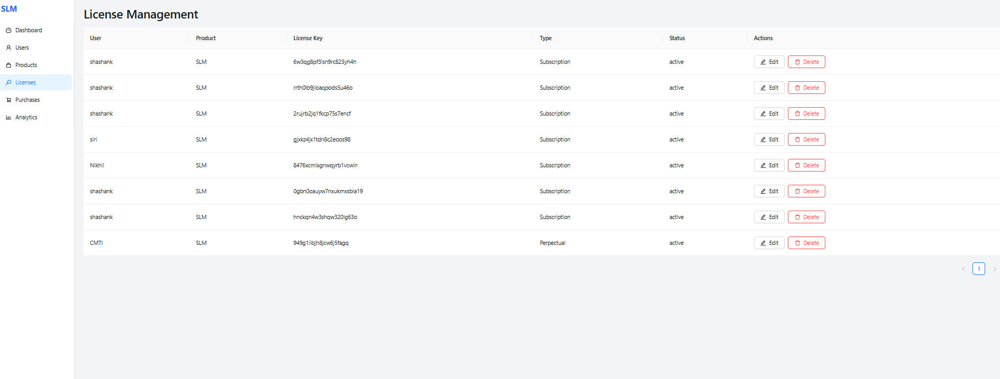
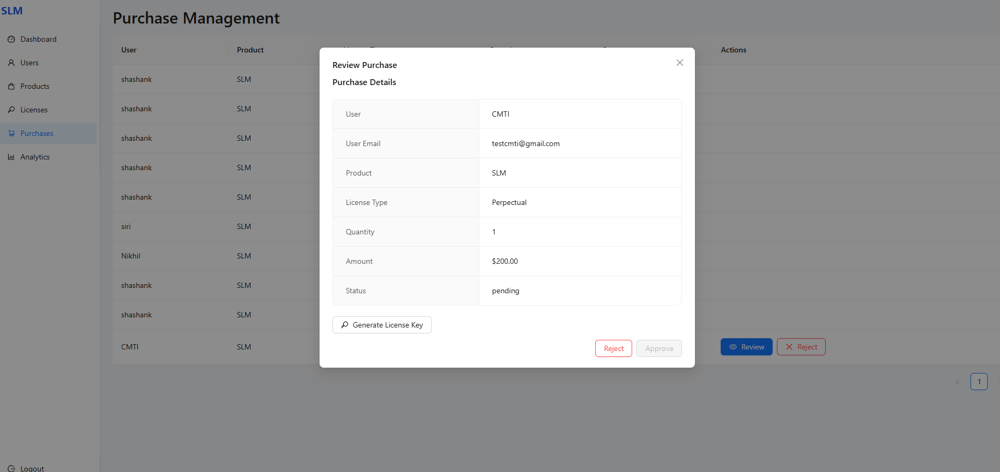
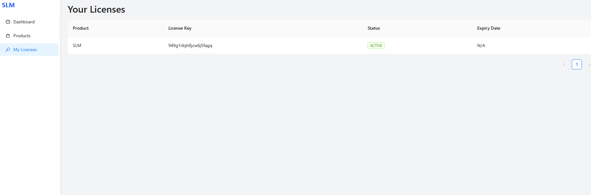

<div style="page-break-after: always;">

# License Management System
## Comprehensive Knowledge Transfer Document

> *Document Version: 2.0*  
> *Last Updated: June 5, 2025*  
> *Prepared by: [Your Name]*

---

## Table of Contents

> **Quick Navigation**  
> [System Overview](#system-overview) • [Architecture](#system-architecture) • [Admin Guide](#admin-workflow) • [User Guide](#end-user-workflow) • [Troubleshooting](#troubleshooting-guide)

---
1. [System Overview](#system-overview)
2. [System Architecture](#system-architecture)
3. [Technical Stack](#technical-stack)
4. [User Workflows](#user-workflows)
   - [Admin Workflow](#admin-workflow)
   - [End User Workflow](#end-user-workflow)
5. [Screenshots and Functionality](#screenshots-and-functionality)
6. [Integration Points](#integration-points)
7. [Troubleshooting Guide](#troubleshooting-guide)
8. [FAQs](#faqs)

## System Overview

### Introduction

The **License Management System (LMS)** is an enterprise-grade solution designed to streamline software license management, user access control, and product activation processes. This system provides organizations with complete control over their software distribution, ensuring compliance with licensing agreements while offering a seamless experience for both administrators and end-users.

### Business Value

- **Revenue Protection**: Prevent unauthorized software usage and license sharing
- **Operational Efficiency**: Automate license provisioning and management
- **Compliance**: Maintain audit trails and ensure software license compliance
- **User Experience**: Provide self-service options for users while maintaining security
- **Business Intelligence**: Gain insights into software usage patterns and license utilization

### Key Features

| Feature | Description | Business Benefit |
|---------|-------------|-------------------|
| 🔐 **User Authentication** | Secure login with role-based access control | Ensures only authorized personnel can manage licenses |
| 🗝️ **License Generation** | Automated key generation with customizable templates | Reduces manual work and errors |
| 📊 **Dashboard** | Real-time insights and analytics | Enables data-driven decision making |
| 🔄 **Activation Tracking** | Monitor license activations and deactivations | Prevents unauthorized usage |
| 👥 **User Management** | Centralized user and role administration | Simplifies access control |
| 📱 **Self-Service Portal** | Users can manage their own licenses | Reduces IT support load |
| 📈 **Reporting** | Comprehensive reporting and audit trails | Ensures compliance and provides insights |

### System Requirements

- **Server**: Node.js 14+ with MongoDB 4.4+
- **Client**: Modern web browser (Chrome, Firefox, Edge, Safari)
- **Network**: Internet connection for license validation
- **Storage**: Minimum 1GB free disk space for database

---

## System Architecture

### High-Level Architecture


### Component Architecture

#### 1. Frontend Layer (React.js)

**Key Components:**
- **Dashboard Module**: Real-time metrics and quick actions
- **User Management**: CRUD operations for user accounts
- **License Administration**: Generate, view, and manage licenses
- **Product Catalog**: Manage software products and versions
- **Reporting Engine**: Generate usage and compliance reports

**Key Features:**
- Responsive design for all devices
- Real-time updates using WebSockets
- Role-based access control (RBAC)
- Audit logging for all actions

#### 2. Backend Layer (Node.js/Express)

**Core Services:**

| Service | Description | Key Endpoints |
|---------|-------------|----------------|
| Auth Service | Handles authentication & authorization | `/api/auth/*` |
| User Service | Manages user accounts and roles | `/api/users/*` |
| License Service | License generation and validation | `/api/licenses/*` |
| Product Service | Product catalog management | `/api/products/*` |
| Activation Service | Handles license activations | `/api/activations/*` |

**Key Features:**
- RESTful API design
- JWT-based authentication
- Request validation and sanitization
- Rate limiting and security headers
- Comprehensive error handling

#### 3. Data Layer (MongoDB)

**Collections Schema:**

```javascript
// Users Collection
{
  _id: ObjectId,
  email: String,
  password: String,
  role: { type: String, enum: ['admin', 'user'] },
  createdAt: Date,
  lastLogin: Date
}

// Products Collection
{
  _id: ObjectId,
  name: String,
  version: String,
  description: String,
  features: [String],
  pricing: {
    type: { type: String, enum: ['one-time', 'subscription'] },
    amount: Number,
    currency: String
  },
  activationLimit: Number
}

// Licenses Collection
{
  _id: ObjectId,
  key: String,
  productId: ObjectId,
  userId: ObjectId,
  status: { type: String, enum: ['active', 'suspended', 'revoked'] },
  activations: [{
    deviceId: String,
    activatedAt: Date,
    lastValidated: Date,
    ipAddress: String
  }],
  validFrom: Date,
  validUntil: Date
}
```

#### 4. Client Library

**Key Features:**
- Machine fingerprinting
- Offline validation
- Tamper detection
- Graceful degradation
- Automatic reactivation

**Integration Example:**
```javascript
const license = new LicenseManager({
  apiUrl: 'https://api.yourdomain.com',
  productId: 'your-product-id',
  storage: 'localStorage', // or 'file' for Node.js
  checkInterval: 3600 // Check every hour
});

// Check license status
const { valid, message } = await license.validate();
if (!valid) {
  console.error('License validation failed:', message);
  // Handle invalid license
}
```

### Data Flow

1. **License Activation**
   ```mermaid
   sequenceDiagram
       participant C as Client App
       participant F as Frontend
       participant B as Backend
       participant D as Database
       
       C->>F: Request Activation
       F->>B: POST /api/activations
       B->>D: Validate License
       D-->>B: License Data
       B->>D: Record Activation
       B-->>F: Activation Response
       F-->>C: Success/Failure
   ```

2. **License Validation**
   ```mermaid
   sequenceDiagram
       participant C as Client App
       participant B as Backend
       participant D as Database
       
       C->>B: Validate License (with machine ID)
       B->>D: Check Activation
       alt Valid License
           D-->>B: Activation Record
           B-->>C: { valid: true, expires: date }
       else Invalid/Expired
           D-->>B: No/Invalid Record
           B-->>C: { valid: false, reason: '...' }
       end
   ```

### Security Considerations

- **Data Encryption**: All sensitive data encrypted at rest and in transit
- **Rate Limiting**: Protection against brute force attacks
- **Input Validation**: Protection against injection attacks
- **CORS**: Properly configured CORS policies
- **Audit Logging**: All sensitive operations are logged
- **Secure Storage**: License data stored securely on client devices

## Technical Stack

### Frontend
- **Framework**: React.js
- **State Management**: Redux/Context API
- **UI Components**: Material-UI
- **Routing**: React Router
- **HTTP Client**: Axios

### Backend
- **Runtime**: Node.js
- **Framework**: Express.js
- **Authentication**: JWT (JSON Web Tokens)
- **Database**: MongoDB with Mongoose ODM
- **Validation**: Joi
- **Logging**: Winston

### Client Library
- **Language**: JavaScript/Node.js
- **Cryptography**: crypto-js
- **HTTP Client**: Axios
- **Persistence**: File system for local storage

## User Workflows

### Admin Workflow

#### 1. Authentication

**Login Process**


**Key Features:**
- Secure login with JWT authentication
- Role-based access control (RBAC)
- Session management
- Failed login attempt tracking


*Figure 1: Admin Login Interface*

#### 2. Dashboard

**Dashboard Components:**
- System health metrics
- License usage statistics
- Recent activities
- Quick action buttons


*Figure 2: Admin Dashboard Overview*

#### 3. User Management

**User Management Workflow**


**Features:**
- User CRUD operations
- Role assignment
- Bulk operations
- Activity logging


*Figure 3: User Management Interface*

#### 4. Product Management

**Product Lifecycle**
1. **Create Product**
   - Basic information
   - Version control
   - Feature sets
   - Pricing models

2. **Update Product**
   - Version updates
   - Feature modifications
   - Deprecation handling


*Figure 4: Product Catalog View*


*Figure 5: Adding a New Product*

#### 5. License Management

**License Generation Process**


**Key Features:**
- Batch generation
- Custom validation rules
- Expiration settings
- Activation limits


*Figure 6: License Management Console*


*Figure 7: Editing License Details*


*Figure 8: License Key Generation*

#### 6. Purchase Management

**Purchase Workflow**
1. Order Processing
2. Payment Verification
3. License Assignment
4. Notification


*Figure 9: Purchase Management View*


*Figure 10: Purchase Review Process*

### End User Workflow

#### 1. Account Management

**Registration Process**


*Figure 11: User Registration Form*


*Figure 12: User Login Screen*

#### 2. User Dashboard

**Dashboard Features:**
- License overview
- Quick actions
- Notifications
- Recent activities


*Figure 13: User Dashboard Overview*

#### 3. License Management

**License Operations:**
- View active licenses
- Check activation status
- Request additional licenses
- Download license files


*Figure 14: User License Management*


*Figure 15: Purchase History*

#### 4. License Activation

**Activation Flow**
1. Enter License Key
2. System Validation
3. Machine Binding
4. Confirmation

**Offline Activation**
1. Generate Activation Request
2. Submit Request File
3. Receive Activation File
4. Complete Activation


*Figure 16: License Activation Process*

### Support Workflow

**Ticket Lifecycle**


**Support Channels:**
- In-app messaging
- Email support
- Knowledge base
- Community forums

## Integration Points

### API Reference

#### Base URL
```
https://api.yourdomain.com/v1
```

#### Authentication
All API requests require an API key or JWT token in the header:
```
Authorization: Bearer YOUR_API_KEY
```

### Core Endpoints

#### 1. Authentication

**Login**
```
POST /api/auth/login
```
Request:
```json
{
  "email": "user@example.com",
  "password": "your_password"
}
```

Response:
```json
{
  "token": "jwt_token_here",
  "user": {
    "id": "user_id",
    "email": "user@example.com",
    "role": "admin"
  }
}
```

#### 2. License Management

**Generate License**
```
POST /api/licenses
```

**Validate License**
```
GET /api/licenses/validate/{key}
```

**Get License Details**
```
GET /api/licenses/{id}
```

### Webhooks

Webhooks allow you to receive real-time updates about system events.

**Available Events:**
- `license.created`
- `license.activated`
- `license.expired`
- `purchase.completed`
- `user.registered`

**Webhook Payload Example:**
```json
{
  "event": "license.activated",
  "data": {
    "licenseKey": "LIC-123-456-789",
    "productId": "prod_123",
    "activatedAt": "2025-06-05T11:30:00Z",
    "machineId": "machine_fingerprint"
  },
  "timestamp": "2025-06-05T11:30:01Z"
}
```

### Client Integration

#### Installation
```bash
npm install @your-org/license-manager
# or
yarn add @your-org/license-manager
```

#### Basic Usage
```javascript
const { LicenseManager } = require('@your-org/license-manager');

// Initialize with your API key
const license = new LicenseManager({
  apiKey: 'your_api_key',
  productId: 'your_product_id',
  storage: 'localStorage' // or 'file' for Node.js
});

// Activate license
async function activateLicense(key) {
  try {
    const result = await license.activate(key);
    console.log('Activation successful:', result);
  } catch (error) {
    console.error('Activation failed:', error.message);
  }
}

// Check license status
async function checkLicense() {
  const status = await license.validate();
  if (status.valid) {
    console.log('License is valid until:', status.expiresAt);
  } else {
    console.error('License is invalid:', status.reason);
  }
}
```

## Troubleshooting Guide

### Common Issues and Solutions

#### 1. Activation Issues

**Problem**: License activation fails

**Solution**:
1. Check internet connection
2. Verify license key format
3. Ensure machine ID hasn't changed
4. Check server logs for errors

**Error Reference**:
```
Error: Invalid license key
  - Verify the key was entered correctly
  - Check if the key has been revoked
  - Contact support if issue persists
```

#### 2. Validation Failures

**Problem**: License validation fails

**Solution**:


#### 3. API Connectivity

**Problem**: Cannot connect to license server

**Troubleshooting Steps**:
1. Check network connectivity
2. Verify API endpoint URL
3. Check CORS configuration
4. Test with Postman/cURL

**Test Command**:
```bash
curl -X GET "https://api.yourdomain.com/health" \
  -H "Authorization: Bearer YOUR_API_KEY"
```

#### 4. Performance Issues

**Problem**: Slow response times

**Optimization Tips**:
- Enable caching where possible
- Use batch operations for multiple licenses
- Implement retry logic with exponential backoff

#### 5. Security Concerns

**Best Practices**:
- Always use HTTPS
- Rotate API keys regularly
- Implement rate limiting
- Use secure storage for sensitive data

### Getting Help

If you're still experiencing issues, please provide:
1. Error message
2. Steps to reproduce
3. Environment details
4. Relevant logs (with sensitive information redacted)

Contact support at: support@yourdomain.com

## FAQs

### Technical
**Q: How do I integrate the license check in my application?**  
A: Include the client library and follow the integration guide. Detailed integration examples are available in the [Integration Guide](#integration-points).

**Q: What data is collected during activation?**  
A: Only the following data is collected:
- Machine ID (hardware fingerprint)
- License key
- Timestamp
- IP address (for security purposes)
- Product/version information

## Conclusion

This document has provided a comprehensive overview of the License Management System, covering its architecture, features, and usage guidelines. The system is designed to be robust, secure, and scalable, meeting the needs of both administrators and end-users.

### Key Takeaways

1. **For Administrators**
   - Centralized license management
   - Real-time monitoring and reporting
   - Granular access control
   - Automated workflows

2. **For Developers**
   - Well-documented RESTful API
   - Client libraries for easy integration
   - Webhook support for real-time updates
   - Comprehensive error handling

3. **For End Users**
   - Simple license activation
   - Self-service portal
   - Clear license status
   - Easy device management

## Appendix

### A. Glossary

| Term | Definition |
|------|------------|
| **Activation** | Process of binding a license to a specific device |
| **API Key** | Unique identifier for API authentication |
| **JWT** | JSON Web Token for secure authentication |
| **Machine ID** | Unique identifier generated from hardware components |
| **Webhook** | Method for real-time notifications |

### B. Error Codes

| Code | Description | Resolution |
|------|-------------|-------------|
| 400 | Bad Request | Verify request parameters |
| 401 | Unauthorized | Check API key/token |
| 403 | Forbidden | Verify permissions |
| 404 | Not Found | Check endpoint URL |
| 429 | Too Many Requests | Implement rate limiting |
| 500 | Server Error | Contact support |

### C. Version History

| Version | Date | Changes |
|---------|------|---------|
| 1.0 | 2024-01-15 | Initial Release |
| 1.1 | 2024-03-22 | Added webhook support |
| 2.0 | 2025-06-05 | Major UI overhaul, New APIs |

### D. Additional Resources

- [API Reference Documentation](https://docs.yourdomain.com/api)
- [Client SDK GitHub Repository](https://github.com/your-org/license-manager-sdk)
- [Support Portal](https://support.yourdomain.com)
- [Knowledge Base](https://help.yourdomain.com)

---

*Document Version: 2.0*  
*Last Updated: June 5, 2025*  
*Prepared by: [Your Name/Team]*  
*Confidential & Proprietary*

---

### Document Control

| Version | Date | Author | Changes |
|---------|------|--------|---------|
| 1.0 | 2024-01-15 | [Author] | Initial version |
| 1.1 | 2024-03-22 | [Author] | Added webhook section |
| 2.0 | 2025-06-05 | [Author] | Major update, new features |

### Reviewers

| Name | Role | Approval Date |
|------|------|---------------|
| [Name] | [Role] | [Date] |
| [Name] | [Role] | [Date] |

### Distribution List

- [Stakeholder 1]
- [Stakeholder 2]
- [Stakeholder 3]

---

*This document and the information contained herein is the confidential and proprietary property of [Your Company Name]. Unauthorized copying or distribution is strictly prohibited.*